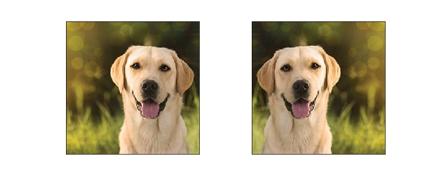

# Image Data Augmentation with Keras

## Steps
* Import Libraries
* Rotation
* Width and Height Shifts
* Brightness
* Shear Transformation
* Zoom
* Channel Shifts
* Flips
* Normalization
  * Featurewise
  * Samplewise
* Rescale and Preprocessing Function
* Using in Model Training
